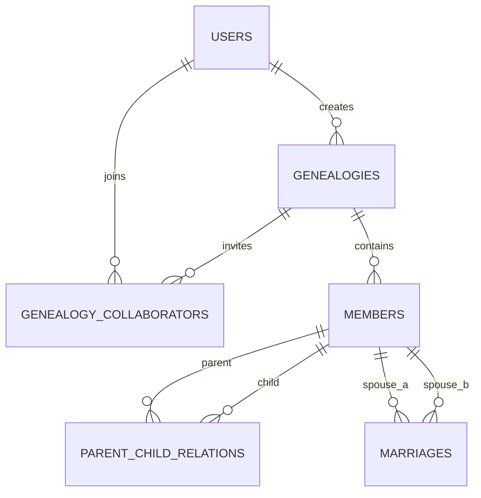

# 族谱管理系统实验报告

## 1. RDBMS 与工程说明

- RDBMS：PostgreSQL 16 或更高版本。
- 本地默认数据库：`genealogy`。
- 本地默认用户：`genealogy_app`。
- 本地默认端口：`5432`。
- 当前工程通过 `database/schema.sql`、`database/indexes.sql` 和 Alembic 初始化数据库结构。
- 当前执行环境未检测到 `psql` 命令；数据库执行截图需在 Windows 本地完成 PostgreSQL 安装后补充到 `docs/report/screenshots/`。

## 2. E-R 图



## 3. 关系模型与范式

- `users(id, username, email, password_hash, is_admin, created_at)`
- `genealogies(id, name, surname, revision_time, owner_user_id, created_at)`
- `genealogy_collaborators(id, genealogy_id, user_id, role, invited_at)`
- `members(id, genealogy_id, name, gender, birth_date, death_date, generation_index, biography, created_at)`
- `parent_child_relations(id, genealogy_id, parent_id, child_id, parent_role, created_at)`
- `marriages(id, genealogy_id, spouse_a_id, spouse_b_id, start_date, end_date, status, created_at)`

范式分析：

- 每张表字段保持原子值，满足 1NF。
- 非主属性依赖各自表的主键，不存在部分依赖，满足 2NF。
- 用户、族谱、成员、亲子关系、婚姻关系、协作者关系分别建模；非主属性不依赖其他非主属性，满足 3NF。
- 亲子关系和婚姻关系拆分成独立关系表，避免在 `members` 中保存重复父母/配偶字段导致更新异常。

## 4. 主键、外键与约束

主键：所有业务表均使用 `BIGSERIAL id`。

外键：

- `genealogies.owner_user_id -> users.id`
- `genealogy_collaborators.genealogy_id -> genealogies.id`
- `genealogy_collaborators.user_id -> users.id`
- `members.genealogy_id -> genealogies.id`
- `parent_child_relations.parent_id -> members.id`
- `parent_child_relations.child_id -> members.id`
- `marriages.spouse_a_id -> members.id`
- `marriages.spouse_b_id -> members.id`

CHECK 与唯一约束：

- `members.gender IN ('male', 'female', 'unknown')`
- `members.death_date >= members.birth_date`
- `members.generation_index >= 1`
- `parent_child_relations.parent_role IN ('father', 'mother')`
- `parent_child_relations.parent_id <> child_id`
- `marriages.spouse_a_id <> spouse_b_id`
- `marriages.status IN ('active', 'ended')`
- `UNIQUE(genealogy_id, user_id)`
- `UNIQUE(parent_id, child_id, parent_role)`
- `ux_marriages_pair`

触发器：

- `validate_parent_child_relation()` 校验亲子双方属于同一族谱、父/母角色性别、父母辈分早于子女、父母出生日期早于子女。
- `validate_marriage_relation()` 校验婚姻双方属于同一族谱。
- 跨行、跨表约束无法用普通 CHECK 完整表达，因此使用 PostgreSQL 触发器实现。

## 5. 索引设计

索引脚本位于 `database/indexes.sql`。

- `idx_members_name_trgm`：GIN trigram 索引，支持姓名模糊查询。
- `idx_members_genealogy_generation`：按族谱和辈分快速统计、排序。
- `idx_members_genealogy_name`：按族谱和姓名过滤。
- `idx_parent_child_parent`：按父节点查询子节点。
- `idx_parent_child_child`：按子节点追溯父母。
- `idx_parent_child_genealogy_parent`：按族谱范围查询后代。
- `idx_parent_child_genealogy_child`：按族谱范围追溯祖先。
- `idx_marriages_spouse_a`、`idx_marriages_spouse_b`：按成员查询配偶。

## 6. 数据生成与导入导出

```powershell
python scripts/generate_demo_data.py --output data/generated
python scripts/validate_generated_data.py --input data/generated
.\scripts\import_csv.ps1 -Database genealogy -User genealogy_app -DataDir data\generated -Reset
.\scripts\export_branch.ps1 -Database genealogy -User genealogy_app -RootMemberId 1 -Output data\exports\branch_1.csv
```

默认数据规模：10 个族谱、105000 名成员、第 1 个族谱 52000 人、每个族谱 30 代、无孤立成员。

## 7. 核心查询与执行结果

核心 SQL 位于：

- `database/core_queries.sql`
- `database/relationship_path.sql`
- `database/performance_compare.sql`

执行结果截图建议保存：

- `docs/report/screenshots/01_family_query.png`
- `docs/report/screenshots/02_ancestor_query.png`
- `docs/report/screenshots/03_generation_lifespan.png`
- `docs/report/screenshots/04_unmarried_male_over_50.png`
- `docs/report/screenshots/05_birth_before_generation_avg.png`
- `docs/report/screenshots/06_performance_without_index.png`
- `docs/report/screenshots/07_performance_with_index.png`

## 8. 性能对比方法

```powershell
.\scripts\run_performance_compare.ps1 -Database genealogy -User genealogy_app -RootMemberId 1
```

脚本先删除父节点查询相关索引，执行四代曾孙查询 `EXPLAIN (ANALYZE, BUFFERS)`，随后重建索引并再次执行同一查询。对比重点是执行时间、扫描方式和 buffer 命中情况。
